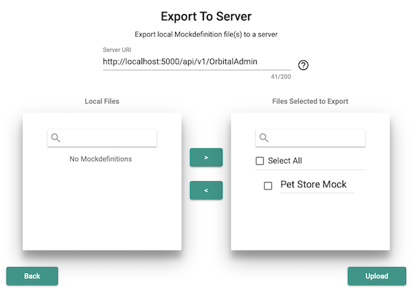

This quick-start guide will show how to make a simple pet store which returns a pet by name. If no pets are found, it will return a custom message.

1. Deploy the components using [Docker](/docs/installation) to start up the designer and server.
2. Navigate to <http://localhost:4200> in your browser.
3. Download [petstore.json](https://raw.githubusercontent.com/OAI/OpenAPI-Specification/master/examples/v2.0/json/petstore.json) or use your own sample OpenAPI file.
4. Click "Create new Mock".

   

5. You will be presented with a list of endpoints available in `petstore.json`. Click on "GET /pets".
6. Activate the completed mock definition by Exporting it to the server

   Click on "Export Mock to Server" in the left-hand sidebar.

   

   The default server url is <http://localhost:5000/api/v1/OrbitalAdmin>. Select the mockdefinition that you&#39;ve created and click the right arrow `>` to move it to the right-hand side, then click "Upload". If there is an error, ensure that the server is running by accessing <http://localhost:5000> in your browser; if it's not running, refer to the [Installation Instructions](/docs/installation) to set it up.

   

7. Navigate to <http://localhost:5000/pets> in your browser. It should display `No pets found`, as a pet has not been specified.
8. Navigate to <http://localhost:5000/pets?pet=sammy> in your browser. It should display `Sammy the cat`.

Congratulations! You have created your very first Orbital Mock. Feel free to edit the example or use a different OpenAPI spec to match different types of requests.

If you want to learn more about scenarios, [policies](/docs/policies), or different rule matching with [header rules](./header-rules), [query rules](./query-rules), [URL rules](./url-rules) and [body rules](./body-rules).
