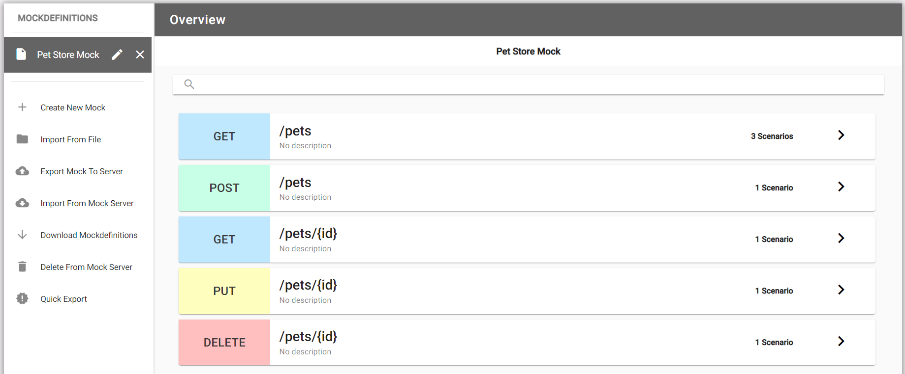
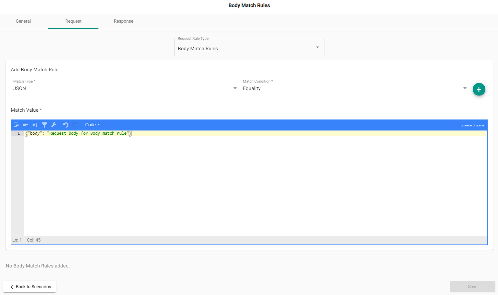
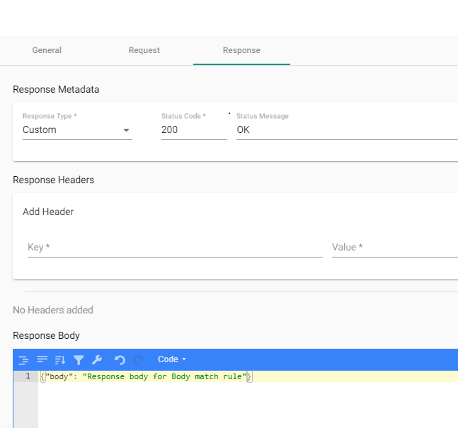

## What are they?

Body rules are rules which determine when the request body is matched. There are several different ways a body
could match a scenario, including text equality, text contains, JSON contains, and more.

## How do they work?

When you add a body match rule and response, this allows you to mock out what the response is to requests with
these chosen body match rules.

After uploading the mockdefinition to the server using the designer, you can now generate a request using CURL commands or your favorite testing tool. Set the request body to match the rule(s) that you have created and receive back the responses mocked out earlier.

### Creating a URL match rule in the designer

Once a new mockdefinition is generated, you start at the Endpoint Overview. This displays the available endpoints
along with their verbs, endpoint path and if there are any existing scenarios.

Select the endpoint to add a scenario, or update an existing one. The following image shows "Default OK Scenario", let's add "Body match rule" scenario for `/pets`.

#### Adding body match rule for /pets

Clicking on the scenario reveals the URL request match rules:

In "Body match rules" scenario select a "Request" tab and chose a "Body Match Rules" option from the "Request Rule Type" dropdown menu. The image shows the match rule of `JSON` and the match condition of `Equality`. Request JSON body `"body": "Request body for Body match rule"`. This rule will check request body to ensure it has the matching value. Click + button to add the rule.

Once a value and rule for the URL match rule has been added, you will need to add a response. Select "Response" tab. The response includes the response type (by default Custom), status code (by default - 200), an optional header and the JSON body `"body": "Response body for Body match rule"` of the response.

Click "Save" to save the scenario and return to the Scenario Overview page.
