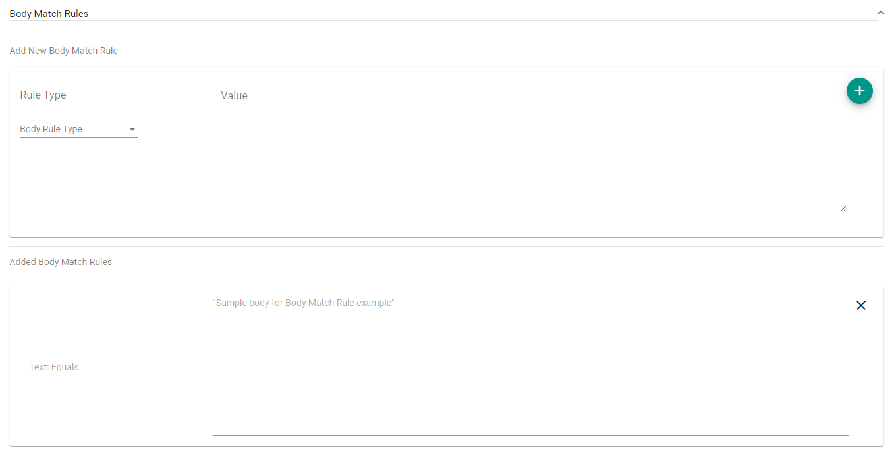
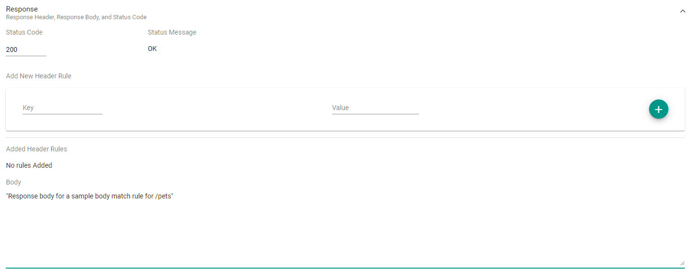

## What are they?

Body rules are rules which determine when the request body is matched. There are several different ways a body
could match a scenario, including text equality, text contains, JSON contains, and more.

## How do they work?

When you add a body match rule and response, this allows you to mock out what the response is to requests with
these chosen body match rules.

After uploading the Mockdefinition to the server using the Orbital Designer, you can now generate a request with
tools like Postman that will meet the criteria of the scenario.

### Creating a URL match rule in the Orbital Designer

Once a new Mockdefinition is generated, you start at the Endpoint Overview. This displays the available endpoints
along with their verbs, endpoint path and if there are any existing scenarios.

Select the endpoint to have a scenario added. There will be a default scenario to get going.

#### The default scenario for /pets

Clicking on the scenario reveals the URL request match rules:

The image shows the rule of `/pets` and the rule type of `Equals`. This
rule will check request URL endpoint path to ensure they have the correct value.

Once a value of the request body and URL has been added, you will need to also add a response. The response
includes the status code and the Body of the response.

Click "Save" to save the scenario and return to the Scenario Overview page.
