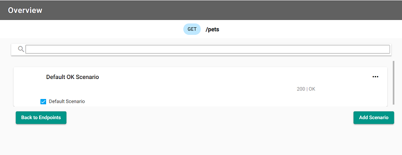
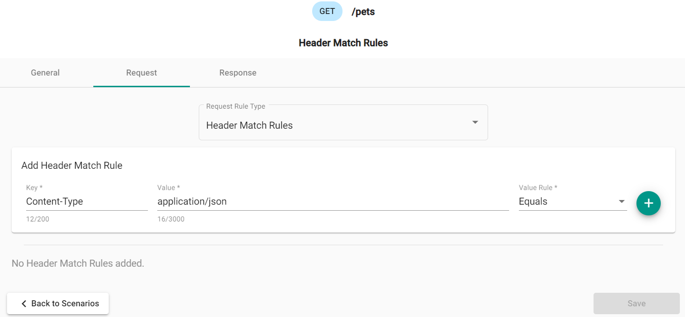
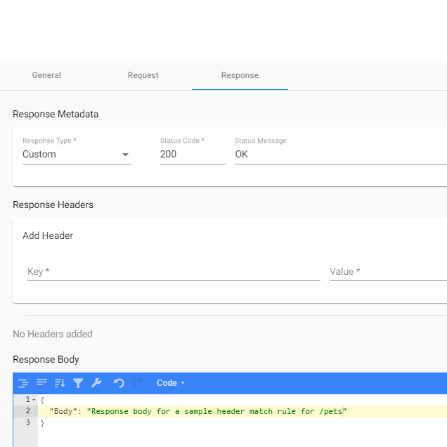

### What are they?

Header match rules are rules that govern the request header properties. This allows you to mock out the different
valid and invalid headers of API endpoints.

### How do they work?

When you add a header match rule and response, this enables you to mock out what the response is to requests with
these chosen header rules.

### Creating a header match rule in the Designer

Once a new mockdefinition is generated, you start at the Endpoint Overview. This displays the available endpoints
along with their verbs, endpoint path and if there are any existing scenarios.

#### Overview of the endpoints

Select the endpoint to add a scenario, or update an existing one. The following image shows a default scenario for `/pets`:

#### Adding a header match rule

The image shows the key value pair of `Content-Type` and `application/json` with the rule type of `Equals`. This
rule will check request headers to ensure they match.

Once a key and a value of the request have been added, you will need to also add a response. The response includes
the status code, an optional header, and the body of the response. The following image shows the response to use:

In the response section, set the status code to `200`.

Click "Save" to save the scenario and return to the Scenario Overview page.
