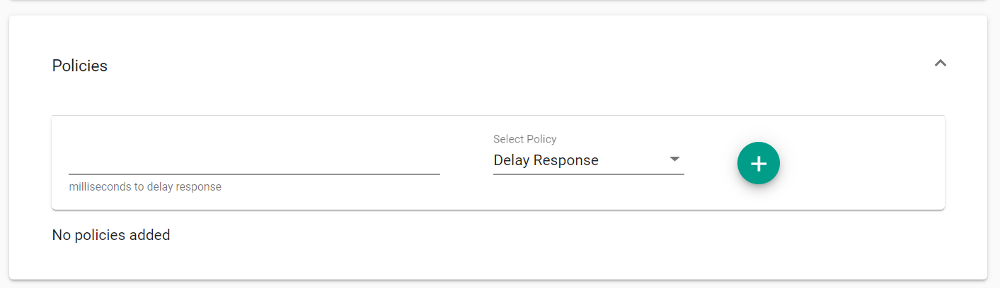
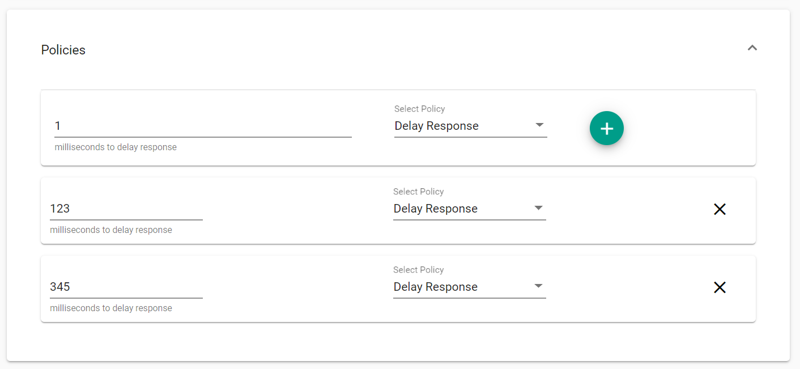

Policies allow certain principles and commands to run after a scenario has been matched. For example, adding a delay policy will delay the request by the specified number of milliseconds within the scenario that the request matched.

## Adding a new policy

To add a new policy, open the “Policy” dropdown in the designer.

Type in the number of milliseconds to delay the request (if it matches this scenario) and click "+" to add it.

Multiple policies can be added, but the policies must be unique. Each policy will be applied sequentially, starting with the first policy at the top of the list. Due to the nature of Orbital, the request will be guaranteed to be delayed as least as long as the sum of all policy delays, but it could be delayed longer due to the time taken to process the request.

**_Warning:_ adding a delay policy for a long period of time can cause the server to hang, as the policies are not cancelled if the request is cancelled. The server must be restarted manually if this situation occurs.**
