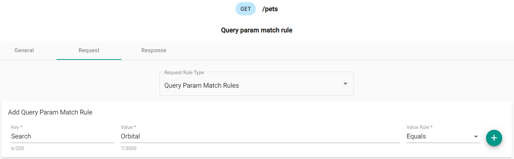

## What are they?

Query match rules are rules that govern the request query properties. This allows you to mock out the different
valid and invalid query values.

Once a key and a value of the request query have been added, you will need to also add a response. The response
includes the status code and the body of the response.

## How do they work?

When you add a query match rule and response, this allows you to mock out what the response is to requests with
these chosen query rules.

After uploading the Mockdefinition to the server using the designer, you can now generate a request with
tools like Postman that will replicate the scenario. Setting the query parameters to match the rule(s) that you
have created and receiving back the responses mocked out earlier.

### Creating a query match rule in the Designer

Once a new Mockdefinition is generated, you start at the Endpoint Overview. This displays the available endpoints
along with their verbs, endpoint path and if there are any existing scenarios.

#### Overview of the endpoints

Select the endpoint to add a scenario, or update an existing one. The following image shows the default scenario for `/pets`.

#### Adding a query match rule

The image shows the key value pair of `Search` and `Orbital` (which will match `https://localhost:5001/?Search=Orbital`)
with the rule of `Equals`. This rule will check request query parameters to ensure they have the correct key and value.

Once a key and a value of the request have been added, you will need to add a response. The response includes
the status code, an optional header and the body of the response. The following image shows which response to use:

In the response section, the status code is a `200`.

Click "Save" to save the scenario and return to the Scenario Overview page.
