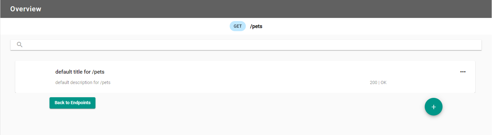

## What are they?

In a mockdefinition file, the scenarios have a series of matching rules, these include query match rules.

Query match rules are rules that govern the request query properties. This allows you to mock out the different
valid and invalid query values.

Once a key and a value of the request query have been added, you will need to also add a response. The response
includes the status code and the body of the response.

## How do they work?

When you add a query match rule and response, this allows you to mock out what the response is to requests with
these chosen query rules.

After uploading the mockdefinition to the server using the Orbital Designer, you can now generate a request with
tools like Postman that will replicate the scenario. Setting the query parameters to match the rule(s) that you
have created and receiving back the responses mocked out earlier.

### Creating a query match rule in the Orbital Designer

Once a new mockdefinition is generated, you start at the Endpoint Overview. This displays the available endpoints
along with their verbs, endpoint path and if there are any existing scenarios.

#### Overview of the endpoints

Select the endpoint to add a scenario, or update an existing one. There will be a default scenario to get going.

#### The default scenario for /pets

#### Adding a query match rule

localhost:4000?Search=Orbital

We have added the key value pair of `Search` and `Orbital` (which should look like
this locally `localhost:4000?Search=Orbital`) with the rule of `Equals`. This
rule will check request query parameters to ensure they have the correct key and value.

Once a key and a value of the request have been added, you will need to add a response. The response includes
the status code, an optional header and the body of the response.

#### Response being populated

In the response section, the status code is a `200` and we added a body.

Now click `Save` to save the scenario and head back to the main Scenario Overview page.
