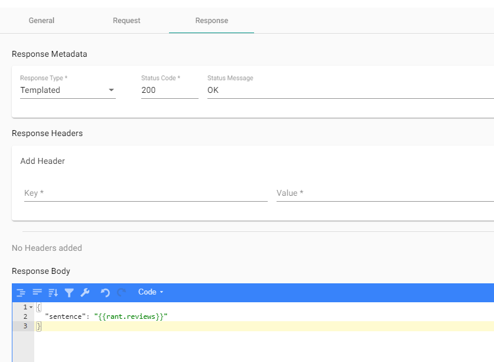

Templated responses allow responses to be dynamically created from the response's JSON body, and/or a random value. For example, adding a templated rant review string will return a random sentence (for example, "The apple ate the orange around the tree".) When requesting the endpoint again, another random sentence will be returned. Or, they can be used to return parts of the request's JSON body.

### How do I add a templated response?

1. In the designer, create a new scenario or select an existing one.
2. Select the "Response" tab.
3. Under "Response Metadata", set the type of the response to "Templated".
4. As an example, set the body of the response to "\{\{rant.reviews\}\}".
5. Save the scenario, and upload it to the server.
6. Make request to the endpoint that contains the templated response.

Figure 1. Adding a new templated rule.

### How do I make a templated response?

In order to use templated responses, the request's body must be valid JSON, the syntax must be valid, the response must be marked as a templated response, and all referenced keys must exist in order to use templated responses. If at least one of these requirements are violated, a `400 Bad Request` will be returned.

A templated response is enclosed with \{\{ and \}\}, with either a reference to a random string (e.g. `rant.reviews`) or part of the response (e.g. `request.abc`.) For example, a templated response which returns a random sentence and a person's first name is given by: "\{\{rant.reviews\}\} abc \{\{person.first_name\}\}".

When composing a templated response, the body can contain multiple templated responses, such as "\{\{rant.reviews\}\} \{\{person.first_name\}\}", and can contain text between and around the templates: "\{\{rant.reviews\}\} abc \{\{person.first_name\}\}". These templates can also be nested inside of JSON. For example, \{"key":"\{\{person.first_name\}\}"\}.

### Templating arbitrary JSON primitives

Templated responses can contain parts of the request JSON, and that request can contain dictionaries, arrays, and more. These primitives are inlined differently depending on what type they are. Here are how these primitives are inlined:

When referencing a JSON key in the request body which is...

- a string or integer, then the templated response will return that value as-is. For example, `"\{\{request.a\}\}"` will return "abc" (without quotes) if the request's body is \{"a":"abc"\}

- is nested, for example, "\{\{request.a.b\}\}" would return "abc" in the request body \{"a":\{"b":"abc"\}\}. Objects can be nested up to 10000 elements deep, otherwise an error is thrown.

- an object, for example "\{\{request.a\}\}" with the request body \{"a":\{"b":"c"\}\}, the response would be "[[c]]".

- an array, for example "\{\{request.a\}\}" with the request body \{"a":[1,2,3,4,"a"]\}, the response would be "[1, 2, 3, 4, a]" even if the elements are quoted.

### More examples

For more examples of the templated responses Orbital supports, see the \*.cs files in the [Functions](https://github.com/FociSolutions/Orbital/tree/master/src/Orbital.Mock.Server/Functions) folder. Note: the method names are dynamically converted from CamelCase to snake_case.
