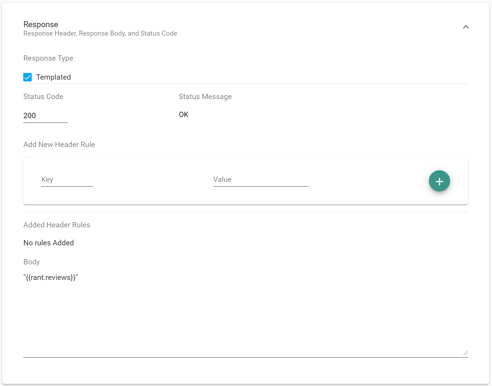

Templated responses allow responses to be dynamically created from the response's body, and/or a random value.

### How do I add a templated response?

1. In the designer, create a new scenario or select an existing one.
2. Open the response tab.
3. Set the type of the response to "Templated".
4. As an example, set the body of the response to "\{\{rant.reviews\}\}".
5. Save the scenario, and upload it to the server.
6. Make request to the endpoint that contains the templated response.

Figure 1. Adding a new templated rule. Note the checkmark next to "Templated".

The server will respond with a rant review string. When composing a templated scenario body, the body can contain multiple templated responses, such as "\{\{rant.reviews\}\} \{\{person.first\_name\}\}", and can contain text between and around the templates: "\{\{rant.reviews\}\} abc \{\{person.first\_name\}\}". These templates can also be nested inside of JSON. For example, \{"key":"\{\{person.first\_name\}\}"\}.

### How do templated responses behave?

In order to use templated responses, the request's body must be valid JSON, the syntax must be valid, the response must be marked as a templated response, and all referenced keys must exist in order to use templated responses. If at least one of these requirements are violated, a `400 Bad Request` will be returned.

### How to use the request body in a templated response

When referencing a JSON key in the request body which is...
- a string or integer, then the templated response will return that value as-is. For example, `"\{\{request.a\}\}"` will return "abc" (without quotes) if the request's body is \{"a":"abc"\}

- is nested, for example, "\{\{request.a.b\}\}" would return "abc" in the request body \{"a":\{"b":"abc"\}\}. Objects can be nested up to 10000 elements deep, otherwise an error is thrown.

- an object, for example "\{\{request.a\}\}" with the request body \{"a":\{"b":"c"\}\}, the response would be "[[c]]".

- an array, for example "\{\{request.a\}\}" with the request body \{"a":[1,2,3,4,"a"]\}, the response would be "[1, 2, 3, 4, a]" even if the elements are quoted.

For examples of which templated responses Orbital supports, see the \*.cs files in the [Functions](https://github.com/FociSolutions/Orbital/tree/master/src/Orbital.Mock.Server/Functions) folder. Note: the method names are dynamically converted from CamelCase to snake\_case.