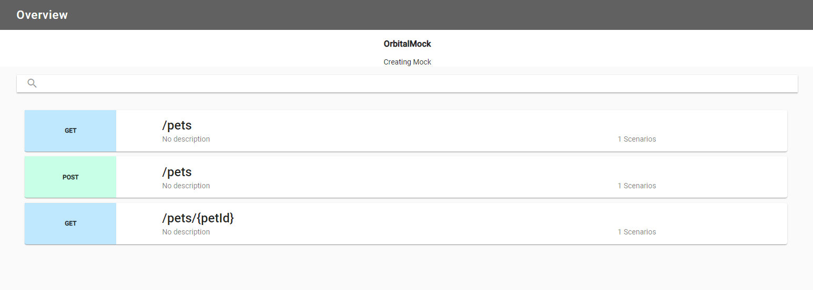
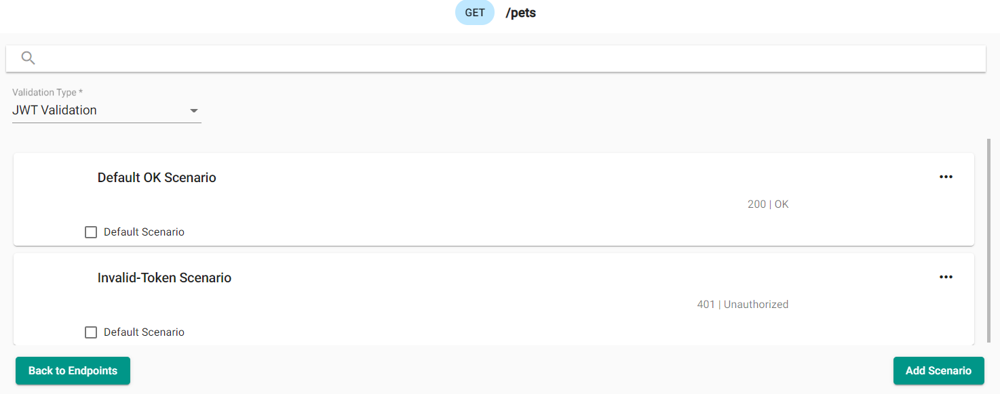

## What are they?

A token payload rule, when created, validates the presence of a mapped key-value pair token payload in a given scenario. The token in a request is a bearer token using the JWT standard that provides a form of validating identity for the server.

## How do they work?

When you add a token payload rule, it allows you to mock out the server's response to different token payload configurations. This can be useful to make sure security principles are upheld in your API design.

### Creating a Token Payload Rule in the designer

When creating a new Mock Definition check the Token Validation checkbox. Once a new Mock Definition is created, you start at the Endpoint Overview page. This displays endpoints and existing scenarios, if there are any.

#### Overview of the Endpoints

Select the endpoint to add a scenario, or update an existing one. The following image shows "Default OK Scenario" and "Invalid-Token Scenario". Select "JWT Validation" from the dropdown menu. Let's add an "Token Payload Match Rule" scenario for `/pets`.

#### Adding a Token Payload Rule
