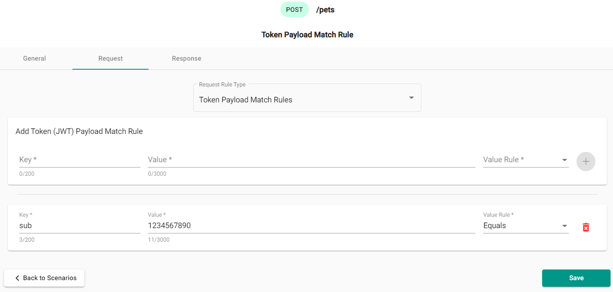
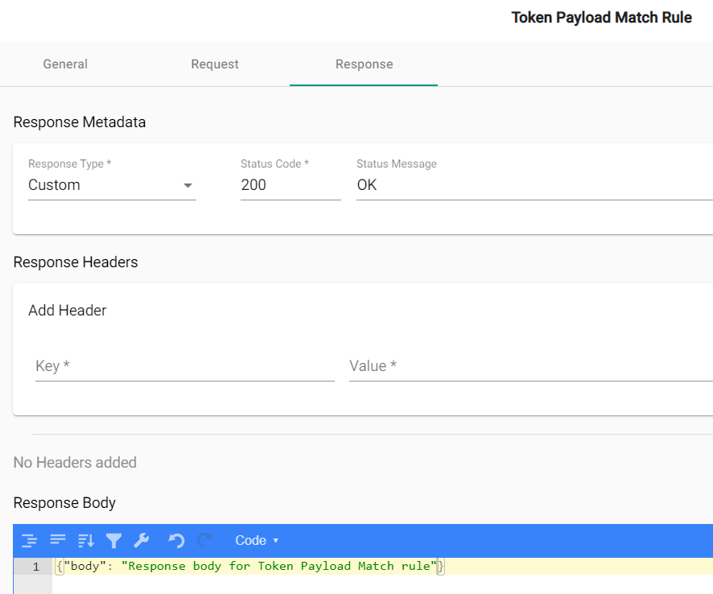

## What are they?

A token payload rule, when created, validates the presence of a mapped key-value pair token payload in a given scenario. The token in a request is a bearer token using the JWT standard that provides a form of validating identity for the server.

## How do they work?

When you add a token payload rule, it allows you to mock out the server's response to different token payload configurations. This can be useful to make sure security principles are upheld in your API design.

### Creating a Token Payload Rule in the designer

When creating a new Mock Definition check the Token Validation checkbox. Once a new Mock Definition is created, you start at the Endpoint Overview page. This displays endpoints and existing scenarios, if there are any.

#### Overview of the Endpoints

Select the endpoint to add a scenario, or update an existing one. The following image shows "Default OK Scenario" and "Invalid-Token Scenario" added by default when Token Validation checkbox is selected. Select "JWT Validation" from the dropdown menu. Let's add a "Token Payload Match Rule" scenario for POST `/pets` endpoint.

#### Adding a Token Payload Rule

In "Token Payload Match Rule" scenario select a "Request" tab and chose a "Token Payload Match Rules" option from the "Request Rule Type" dropdown menu. The image shows the example of key value pair of `Authorization` and `Bearer` with the rule type of `Equals` for the scenario. This rule will check request Token (JWT) Payload to ensure the match. Click + button to add the rule.

Once a request rule has been added, you will need to also add a response. Select "Response" tab. The response includes
the response type (by default Custom), status code (by default - 200), an optional header, and the JSON body `"body": "Response body for Token Payload Match rule"` of the response. The following image shows the example of the response:

Clicking "Save" adds new response to scenario.
