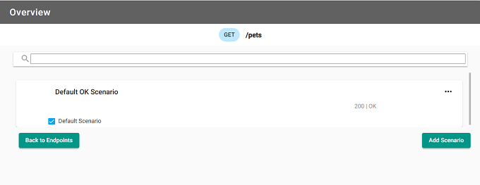

## What are they?

URL match rules are rules that govern the request URL endpoint path property. This allows you to mock out the different
valid and invalid endpoint path URL values.

## How do they work?

When you add a URL match rule and response, this enables you to mock out what the response is to requests with
these chosen URL match rules.

After uploading the mockdefinition to the server using the designer, you can now generate a request using CURL commands or your favorite testing tool. Set the URL endpoint path to match the rule(s) that you
have created and receive back the responses mocked out earlier.

### Creating a URL match rule in the Designer

Once a new mockdefinition is generated, you start at the Endpoint Overview. This displays the available endpoints
along with their verbs, endpoint path and if there are any existing scenarios.

#### Overview of the endpoints

Select the endpoint to add a scenario, or update an existing one. Once a new mockdefinition is generated, you start at the Endpoint Overview. The following image shows "Default OK Scenario", let's add "URL match rule" scenario for `/pets`.

#### Adding a URL match rule

In "URL match rules" scenario select a "Request" tab and chose a "URL Match Rules" option from the "Request Rule Type" dropdown menu. The image shows the rule value of `/pets` and the rule type of `Equals`. This
rule will check the request URL endpoint path to ensure they have the same value.

Once a value and rule for the URL match rule has been added, you will need to add a response. Select "Response" tab. The response includes the response type (by default Custom), status code (by default - 200), an optional header and the JSON body `"body": "Response body for URL match rule"` of the response.

Click "Save" to save the scenario return to the Scenario Overview page.
