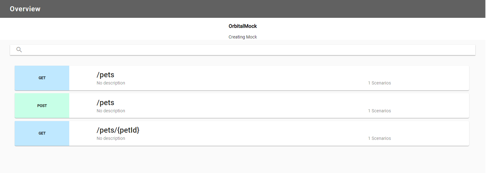
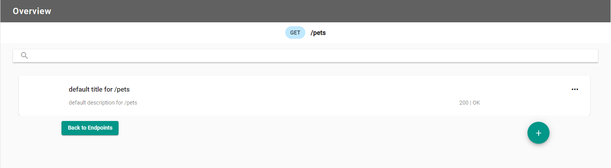
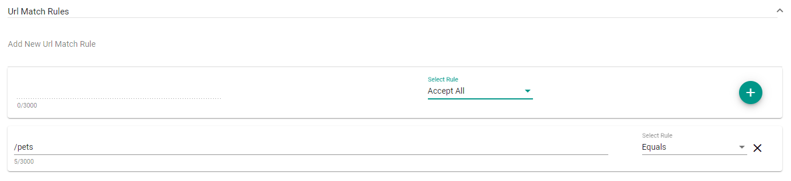
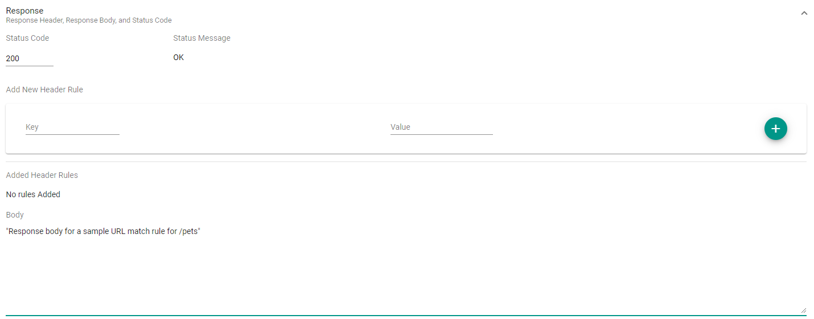

## What are they?

URL match rules are rules that govern the request URL endpoint path property. This allows you to mock out the different
valid and invalid endpoint path URL values.

## How do they work?

When you add a URL match rule and response, this enables you to mock out what the response is to requests with
these chosen URL match rules.

After uploading the Mockdefinition to the server using the designer, you can now generate a request with
tools like Postman that will replicate the scenario. Setting the URL endpoint path to match the rule(s) that you
have created and receiving back the responses mocked out earlier.

### Creating a URL match rule in the Designer

Once a new Mockdefinition is generated, you start at the Endpoint Overview. This displays the available endpoints
along with their verbs, endpoint path and if there are any existing scenarios.

#### Overview of the endpoints

Select the endpoint to add a scenario, or update an existing one. There will be a default scenario to get going.
The following image shows the default scenario for `/pets`.

#### Adding a URL match rule

The image shows the rule value of `/pets` and the rule type of `Equals`. This
rule will check the request URL endpoint path to ensure they have the same value.

Once a value and rule for the URL match rule has been added, you will need to add a response. The response
includes the status code, an optional header and the body of the response.

In the response section, the status code is a `200`, and a body has been added for the response.

Click "Save" to save the scenario return to the Scenario Overview page.
